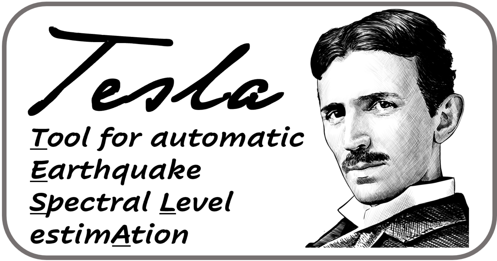

---

## Overview 📜
TESLA (Tool for Automatic Earthquake Low-Frequency Spectral Level Estimation) is a Python-based tool designed to optimize the spectral analysis of earthquake waveforms. It focuses on low-frequency spectral level estimation by adapting signal window selection based on the signal complexity. By inverting the P- and S-displacement spectra, TESLA identifies the optimal signal window for spectral analysis, moving beyond traditional fixed-duration signal windows to offer more accurate analysis, especially for microseismicity.

## Features 🚀
- **Automatic Signal Window Selection** : TESLA automates the selection process of signal windows, ensuring the spectral analysis is as precise as possible by considering the effect of earthquake's magnitude and the  characteristics of microseismic waveforms.
- **Systematic Exploration** : The tool systematically explores various signal windows, performing a comprehensive analysis to compute the displacement spectra for both P and S phases.
- **Comprehensive Spectral Analysis** : Evaluates all selected signal windows to conduct in-depth spectral analyses and calculate displacement spectra.
- **Quantitative Evaluation** : Utilizes quantitative criteria to select the best displacement spectra, offering accurate estimates of low-frequency spectral levels.

## Purpose 🎯
TESLA enhances low-frequency spectral level estimation by systematically selecting signal windows, overcoming the limitations of traditional fixed-duration window methods, especially in the analysis of microseismicity. TESLA enhances seismic event analysis, especially for low magnitude events, by providing additional observables such as P and S low-frequency spectral levels. These insights can refine focal mechanism constraints together with P-wave polarities and facilitate seismic moment and moment magnitude estimations.

## Advantages :trophy:

- **Open Source** : Written in Python, TESLA is freely available for seismic research.
- **Modular Architecture** : Designed for easy modifications to meet specific research needs.
- **Highly Configurable** : Fine-tune TESLA's settings for varied processing needs, making it a versatile tool for seismic data analysis.

## Getting Started 🏁
Clone the TESLA repository and follow the setup indications provided in the documentation. Detailed instructions will guide users through data preparation and the estimation of low-frequency spectral levels.

## Documentation and References 📚
For complete documentation, updates, and examples, visit the [TESLA Documentation](https://tesla.readthedocs.io/en/latest/index.html). Find relevant research and papers in the documentation's references section.

### Key Reference 📖
When using TESLA for your projects and research, please ensure to reference the following publication:

- Adinolfi, Guido Maria, Vincenzo Convertito, and Raffaella De Matteis. "TESLA, A Tool for Automatic Earthquake Low‐Frequency Spectral Level Estimation: The Study of 2013 St. Gallen Earthquake Fault‐Plane Solutions." Seismological Research Letters 94.5 (2023): 2441-2455. [DOI](https://doi.org/10.1785/0220230033)

## Version Information 📅
- **Version:** 1.0.0
- **Last Updated:** February 12, 2024
- **Author:** Guido Maria Adinolfi

## Copyright 📄
Copyright (C) 2023 Guido Maria Adinolfi, University of Turin, Turin, Italy.

TESLA is developed for research purposes and its use should adhere to ethical standards.

## Contact and Collaboration 📧
For any questions, technical support, or to report bugs related to the code, and for any scientific inquiries, please do not hesitate to contact me at guidomaria.adinolfi@unito.it. I am always open to discussing research interests and exploring potential scientific collaborations.

## Future Updates and Upcoming Events :hourglass_flowing_sand:
Keep an eye on this section for the latest on TESLA's development and upcoming events related to our project. We are committed to continuous improvement and making TESLA more efficient.

Stay tuned for more information and specific updates!
