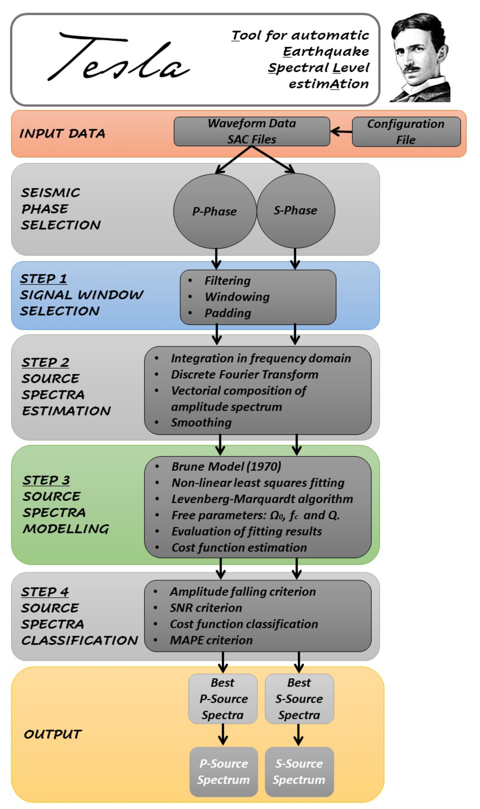

**Introduction**
================
TESLA (Tool for automatic Earthquake low-frequency Spectral Level Estimation) is a Python-based tool designed to perform spectral analysis of earthquake waveforms and estimate low-frequency spectral levels. This manual provides a comprehensive guide to using TESLA for analyzing seismic data and obtaining spectral level estimates.

**Purpose of TESLA**
--------------------
TESLA aims to automate the process of estimating low-frequency spectral levels of seismic signals by optimizing the selection of signal windows for spectral analysis. Traditional methods often use fixed-duration signal windows, which may not be suitable for analyzing microseismicity. TESLA addresses this limitation by systematically exploring different signal windows based on earthquake magnitude and performing spectral analysis to determine the best-displacement spectra.

**Features and Capabilities**
-----------------------------
TESLA offers the following features and capabilities:
- Automatic Window Selection: TESLA systematically explores multiple signal windows to determine the optimal window for spectral analysis, considering earthquake magnitude.
- Spectral Analysis: TESLA performs spectral analysis on seismic waveforms using the selected signal windows to estimate displacement spectra.
- Low-Frequency Spectral Level Estimation: TESLA evaluates and selects the best-displacement spectra based on quantitative criteria and provides estimates of low-frequency spectral levels.
- Customization: TESLA allows users to customize configuration settings and parameters according to their specific needs.
- Command Line Interface: TESLA offers a command line interface for convenient and efficient usage.

**TESLA's Approach to Spectral Analysis**
-----------------------------------------
TESLA focuses on inverting the P- and S-displacement spectra, searching for the optimal signal window for spectral analysis. Unlike the traditional approach of using a fixed-duration signal window, TESLA's approach takes earthquake magnitude into account and explores various signal windows. This is particularly important when analyzing microseismicity, where the characteristics of the seismic signals can vary significantly.

TESLA performs three main tasks for both P and S phases:

1. Systematic Exploration of Signal Windows: TESLA explores multiple signal windows to be used for computing displacement spectra. This systematic exploration of signal windows is performed to account for the earthquake magnitude or complicated seismic signal characteristics.
2. Spectral Analysis: For each selected signal window, TESLA performs spectral analysis on seismic waveforms, calculating the displacement spectra.
3. Evaluation of Best-Displacement Spectra: TESLA evaluates the calculated displacement spectra using quantitative criteria. The tool estimates low-frequency spectral levels, providing valuable insights into the seismic signal's characteristics.

.. raw:: latex

   \vspace{1cm}

   Workflow of the Tool for automatic Earthquake lowfrequency Spectral Level estimAtion (TESLA) code. 