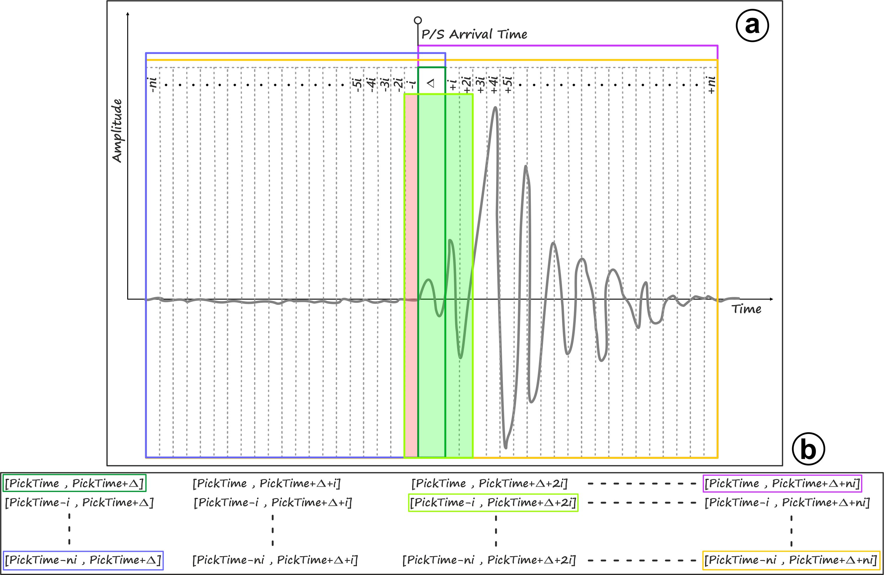

**Method**
==========

This section provides an in-depth understanding of TESLA's operational procedure, encompassing both practical and theoretical aspects essential for its implementation and application. The data processing in TESLA involves four main steps, as elaborated upon below.

**Waveform Preprocessing**
--------------------------

The initial step involves processing waveform data in SAC format, where P- and/or S-arrival times should be present in the header. The data is filtered and cut around the P- and S-picks, using various signal windows with adaptable starting and ending times. These windows are defined relative to the P- or S-pick times, with a minimum signal length, Δ, determined from the pick times. By shifting the minimum signal length, different time windows can be obtained. The configuration file dictates three key parameters: 1) the minimum length of signal analyzed after the pick arrival time (Δ), 2) the incremental step of the signal window (i), and 3) the maximum length of signal (ni) to extend the window on both sides.

**Displacement Spectra Computation and SNR Estimation**
------------------------------------------------------

Each signal window is transformed into the frequency domain using the Fast Fourier Transform algorithm (FFT). The goal is to estimate the low-frequency level of the displacement spectrum for P or S waves. An integration operation of the signal in the frequency domain is performed by dividing the velocity spectrum by frequency. The displacement amplitude spectra of the horizontal and vertical components are then combined into a single displacement spectrum. The spectrum is smoothed using a Hann window, with parameters specified in the configuration file. TESLA also performs a signal-to-noise ratio (SNR) estimation in the frequency domain, using a pre-P noise window of equal length to the explored signal window. Low SNR signals are discarded.

**Curve Fitting**
-----------------

The amplitude spectrum is modeled using a fitting operation based on the seismic source model proposed by Brune (1970) and revised by Boatwright (1980). The final spectrum is a vectorial composition of single displacement spectra from each component. TESLA employs the Levenberg-Marquardt algorithm for fitting, producing estimates of fit parameters and their uncertainties, along with the goodness of curve fitting. The prediction accuracy is evaluated using the Mean Absolute Percentage Error (MAPE), which is a normalized measure of the average percentage difference between observed and predicted values.

**Spectra Selection and Classification**
----------------------------------------

TESLA selects the best spectra based on quality criteria, discarding those that do not meet certain criteria. The spectra are classified according to a cost function (CF), which considers MAPE and uncertainties of estimated parameters. The computed spectra are ordered based on ascending CF values, and TESLA selects spectra falling within the first quartile. A final selection can also be performed based on MAPE as a percentage value. The best result is chosen as the fitted source spectrum with the lowest CF value.

For further details and visual representations, please refer to the original `manuscript <https://pubs.geoscienceworld.org/ssa/srl/article-abstract/94/5/2441/624404/TESLA-A-Tool-for-Automatic-Earthquake-Low?redirectedFrom=fulltext>`_.
 
.. raw:: latex

   \vspace{1cm}

   (a) Examples of different signal windows explored by TESLA. The time windows, for which starting and ending times
   are highlighted in panel (b) with the same color, are indicated with colored border rectangles. The reference time is P/S arrival
   time. Δ is the minimum length of signal analyzed after the pick arrival time. i is the incremental step of the signal window and 
   ni is the maximum length of signal to add to Δ, toward left and right.
